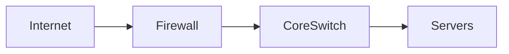
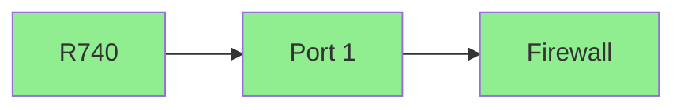

# Full DCIM & Diagramming Implementation

## Overview

This implementation adds comprehensive DCIM (Data Center Infrastructure Management) and diagramming capabilities to Skra, enabling:

1. **Full rack/infrastructure tracking** - U-positions, power, cables
2. **Network topology diagrams** - Auto-generated from live data
3. **Mermaid diagram support** - Native markdown diagrams in documents
4. **NinjaOne & Meraki integration** - Auto-discovery and sync

---

## Data Model (DCIM)

### New Entities

| Entity | Purpose | Key Fields |
|--------|---------|------------|
| **Rack** | Physical rack tracking | `rack_units`, `power_capacity_va`, `weight_capacity_kg`, `row`, `position` |
| **RackDevice** | Device installed in rack | `u_position`, `u_height`, `power_draw_va`, `mounted_rear` |
| **Circuit** | Power circuit/panel tracking | `voltage_v`, `amperage_a`, `phase`, `is_redundant` |
| **PoweredDevice** | Device to circuit linkage | `psu_number`, `power_draw_va` |
| **Cable** | Physical cable tracking | `cable_type`, `length_m`, `end_a/b_config_id`, `end_a/b_port` |
| **PatchPanel** | Structured cabling | `port_count`, `panel_type`, `u_position` |
| **PatchPanelPort** | Individual port | `port_number`, `front/rear_cable_id`, `vlan_id` |

### Power Calculations

```python
# Circuit capacity
capacity_va = voltage_v * amperage_a

# Rack utilization
available_va = rack.power_capacity_va - rack.power_in_use_va
available_kg = rack.weight_capacity_kg - rack.weight_in_use_kg
```

---

## Mermaid Diagram Service

### Supported Diagram Types

#### 1. Network Topology (Flowchart LR)



**Features:**
- Auto-generated from configurations and cables
- Color-coded status (green=up, red=down, yellow=warning)
- Shape-coded device types (firewall=diamond, switch=box, server=stadium)
- Live IP addresses and port labels

#### 2. Rack Elevation (Block Diagram)

```mermaid
block-beta
    columns 42
    u42["Dell R740"]:2
    u40[""]:1
    ...
    
    classDef occupied fill:#e1f5fe
    classDef empty fill:#f5f5f5
```

**Features:**
- Visual 42U rack representation
- Color-coded occupied/empty slots
- Power consumption per device
- Click to view device details

#### 3. Cable Maps

- Device-specific cable tracing
- Port-to-port labeling
- Cable type identification

---

## Network Discovery Integrations

### NinjaOne RMM

**API Coverage:**
- OAuth authentication
- Device enumeration
- Network interfaces
- Online/offline status

**Mapping:**
```
NinjaOne              → Skra
---------------------|------------------
systemName           → Configuration.name
deviceClass          → Configuration.configuration_type
networkInterfaces    → Configuration.ip_address
online               → Configuration.status
siteName             → Location matching
```

### Cisco Meraki

**API Coverage:**
- Organization networks
- Device inventory
- Link layer topology
- Port connections

**Special Features:**
- Automatic topology discovery via LLDP/CDP
- Switch port mappings
- Uplink identification
- Network hierarchy

**Mapping:**
```
Meraki                → Skra
---------------------|------------------
networks[]           → Location matching
devices[].serial     → Configuration.external_id
linkLayer topology   → Cable connections
device.status        → Configuration.status
```

---

## Auto-Generated Diagrams

### Document Type: `mermaid_diagram`

Documents with special metadata for auto-generation:

```json
{
  "document_type": "mermaid_diagram",
  "metadata": {
    "diagram_type": "network_topology",
    "auto_generated": true,
    "auto_update": true,
    "generator_version": "1.0"
  }
}
```

### Update Triggers

Diagrams regenerate when:
- Configuration added/removed/updated
- Cable added/removed
- Device status changes (via sync)
- Manual refresh requested

### Storage

- Diagram source (Mermaid) stored in document `content`
- Rendered client-side with Mermaid.js
- Exportable as SVG/PNG

---

## Frontend Components

### MermaidDiagram Component

```tsx
<MermaidDiagram
  chart={mermaidCode}
  autoRefresh={true}
  refreshInterval={300}
  onRefresh={() => regenerate()}
/>
```

**Features:**
- Live rendering with error handling
- Zoom controls (50%-200%)
- Export SVG/PNG
- Auto-refresh toggle
- Status legend

### DiagramsPage

Management interface:
- List all diagrams
- Generate new diagrams
- Manual refresh
- Statistics cards
- Type filtering

### MarkdownWithDiagrams

Automatic detection in documents:
- Parses ` ```mermaid ` code blocks
- Renders inline diagrams
- Maintains regular markdown flow

---

## API Endpoints (Proposed)

```
POST   /api/diagrams/generate              # Create new diagram
POST   /api/diagrams/{id}/refresh          # Regenerate existing
GET    /api/diagrams/{id}                  # Get diagram
GET    /api/diagrams/{id}/export.svg        # Export SVG
GET    /api/diagrams/{id}/export.png        # Export PNG
```

### Request: Generate Diagram

```json
{
  "diagram_type": "network_topology",
  "rack_id": "uuid",           // For rack diagrams
  "device_id": "uuid",         // For cable maps
  "auto_update": true
}
```

### Response

```json
{
  "id": "doc-uuid",
  "name": "Network Topology (Auto)",
  "content": "flowchart LR\\n...",
  "diagram_type": "network_topology",
  "auto_update": true
}
```

---

## Configuration & Environment

### Required Settings

```python
# NinjaOne Integration
NINJAONE_API_URL=https://api.ninjaone.com
NINJAONE_CLIENT_ID=xxx
NINJAONE_CLIENT_SECRET=xxx

# Meraki Integration  
MERAKI_API_KEY=xxx
MERAKI_ORGANIZATION_ID=xxx

# Auto-Discovery Schedule
DISCOVERY_INTERVAL_HOURS=6
DIAGRAM_REFRESH_INTERVAL_MINUTES=30
```

### Sync Modes

1. **Full Sync** - All devices, topology, diagrams
2. **Quick Sync** - Status updates only
3. **Diagram Refresh** - Regenerate without device sync

---

## Migration from IT Glue

### Rack/Floor Plan Migration

IT Glue's "Configurations" with rack positions can migrate to:
- **Rack** entity (rack name, U-height)
- **RackDevice** (U-position, height)
- **Configuration** (device details)

### Document Diagram Migration

IT Glue documents with embedded diagrams:
1. Export diagram images
2. Create new Mermaid diagrams
3. Or use Draw.io embed for complex diagrams

### Cable Documentation

IT Glue's "Flexible Assets" for cable tracking → **Cable** entities:
- End A/B device references
- Port labels
- Cable types

---

## Implementation Status

### Completed ✅

- [x] DCIM data models (Rack, RackDevice, Circuit, Cable, PatchPanel)
- [x] Mermaid diagram generation service
- [x] Network topology auto-generation
- [x] Rack elevation diagram generation
- [x] NinjaOne integration skeleton
- [x] Meraki integration skeleton
- [x] React Mermaid component with zoom/export
- [x] Diagrams management page
- [x] Markdown integration

### Remaining Tasks 📋

1. **Database migrations** - Create tables for DCIM entities
2. **API endpoints** - Diagram generation/refresh REST endpoints
3. **Rack management UI** - Add/edit racks, drag-drop devices
4. **Cable management UI** - Port connection interface
5. **Discovery scheduler** - Background job for NinjaOne/Meraki sync
6. **Topology algorithms** - Better layout for complex networks
7. **Testing** - Unit tests for diagram generation
8. **Documentation** - User guide for diagram features

### Dependencies to Add

```bash
# Frontend
npm install mermaid

# Backend
pip install httpx  # Already have for API client
```

---

## Usage Examples

### Manual Diagram in Document

```markdown
# Server Rack A

## Rack Elevation

```mermaid
block-beta
    columns 42
    u42["Dell R740 (2U)"]:2
    u41["Cisco 2960X"]:1
    u40[""]:1
    ...
    classDef occupied fill:#e1f5fe
    classDef empty fill:#f5f5f5
    class u42,u41 occupied
```

## Network Connections


```

### Auto-Generated Network Topology

1. Configure NinjaOne/Meraki credentials
2. Run sync: Devices → Configurations
3. Generate diagram: Cables + Configs → Mermaid
4. View in Documents (auto-updates every 30 min)

---

## Benefits over IT Glue

| Feature | IT Glue | Skra DCIM |
|---------|---------|--------------|
| Rack elevations | Image uploads | Interactive SVG |
| Network diagrams | Draw.io embed | Auto-generated |
| Live status | Manual | NinjaOne/Meraki sync |
| Cable tracking | Flexible assets | Dedicated entities |
| Power calculations | Manual | Automatic (VA) |
| Export | PDF | SVG/PNG/Markdown |
| Version control | Limited | Git + History |

---

## Next Steps

1. **Create database migrations** for DCIM tables
2. **Build Rack management UI** - CRUD for racks, device placement
3. **Implement API endpoints** for diagram generation
4. **Test with real NinjaOne/Meraki data**
5. **Add background scheduler** for auto-sync
6. **Create user documentation**

Want me to continue with the database migrations and API endpoints?
